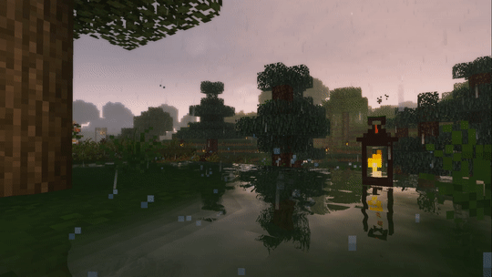

<samp>

# 
<samp>Hello there! I'm Luan Batista</samp>

## 
Who am I?

- I'm a mobile developer!
- I currently work with flutter!
- I'm interested in mobile design!
- I am academic in systems analysis and development at (Federal Institute of Education, Science and Technology of Rondônia - IFRO)
- Graduated in computer technician at (Federal Institute of Education, Science and Technology of Rondônia - IFRO)

## <samp>
What am I learning?
</samp>

- Figma: Visual design of a mobile site
- Learning how Flutter works behind the scenes
- I also want to improve my JavaScript knowledge to create a personal website.
</samp>

<a href="https://github.com/luanbatistadev">

  

  

</a>

<samp>

## 
What do I know how to do?

- I like to edit videos
- I have a cuts channel on <a href="https://www.youtube.com/channel/UCcwByV-6d_JWdnEspfLTJpQ">Youtube</a>
## 
Main knowledge in:

  <code></code>
  <code></code>
  <code></code>
  <code></code>
  <code></code>
  <code></code>
<code></code>
<code></code>
<code></code>
<code>
<code></code>
<code></code>
<code></code>
<code></code>

### 
Basic knowledge

- Information security: nmap and etc | Data Structure | Data Science | APIs: Rest and GraphQL

# 
Bye! See you soon!

</samp>

